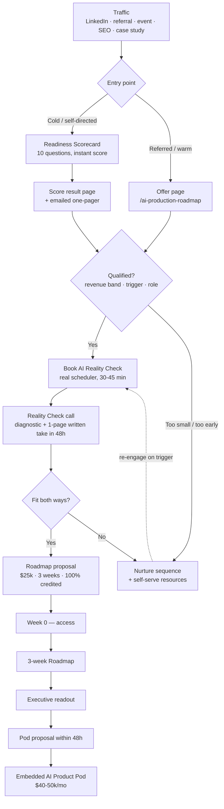

# Project Plan — The AI Production Roadmap (the compelling offer)

*Drafted 2026-08-10 · Owner: Calvin · Status: for team alignment, not yet approved*

This is the build plan for Step 1 of the offer ladder — the paid entry product — plus the free
consult above it and the website flow that feeds both. It covers what the customer walks away
with, how we produce it, how the site converts into it, the copy, the unit economics, and who
does what by when.

**It does not block on the positioning decision.** The offer's structure, deliverables,
production process, pricing, and funnel mechanics are all positioning-independent. The only
thing Decision #1 changes is how vertical-specific the *copy* gets. Wedge-dependent lines are
marked `[WEDGE]` throughout §7 — swap those, keep everything else. This work can start now.

---

## 1. Why this offer is the highest-leverage thing we build

Three facts from the audit, stacked:

1. **Our buyer has already failed once.** 95% of enterprise GenAI pilots show no measurable
   P&L impact. Externally-partnered builds succeed roughly 67% of the time vs. 33% internal.
2. **Right now a $5k prospect and a $500k prospect fill out the same form.** No named offer, no
   qualification, no booking link, no lead magnet.
3. **Every winning competitor sells a named first step that structurally leads to the long
   engagement.** PressW: Audit → Pods → Managed AI. Caxy: free Systems Check → $50k+.
   Morningside: $60k audit → $250k builds.

So the offer is not a marketing asset that describes our services. It is the *qualification
instrument and the sales mechanism*, and it has one structural job: **convert a burned buyer
into a pod client inside 90 days.**

A second job, almost as valuable: it forces us to write down our own method. Right now
"how SeeSaw takes AI to production" lives in people's heads. Productizing it is what makes it
sellable by someone other than Jeff — which is BHAG #4.

### What makes it different from every other AI audit on the market

**The adoption assessment.** Nobody else's audit asks "will humans actually use this." That is
the entire thesis in one deliverable line item, and it is the thing PressW structurally cannot
copy — they have no design capability anywhere on their site.

Everything below is built to make that claim concrete rather than rhetorical.

---

## 2. The offer at a glance

| | |
|---|---|
| **Name** | AI Production Roadmap |
| **Price** | **$25,000** — see the note below on why the top of the range, not the middle |
| **Duration** | 3 weeks delivery + a ~3-day Week 0 (access & scheduling) that precedes the clock |
| **Credit** | 100% credited against a pod engagement signed within 90 days of the readout |
| **Sold to** | The economic buyer: CTO / VP Eng / CEO / Chief AI Officer, or a PE operating partner |
| **Capacity** | 2 concurrent maximum. Target 2 per quarter to start, 8/year at steady state |
| **Feeds** | Embedded AI Product Pod, $40–50k/mo, 6–12 months |

### On price: recommend $25,000, not the $20–25k range

Three reasons to take the top of the range and publish a single number:

- **The price is the filter.** We have said we don't want $10k two-week engagements. A range
  invites negotiation into the bottom of it; a single number doesn't.
- **The credit removes the buyer's risk, so the number can be brave.** If they convert, the
  roadmap is functionally free. A higher number costs us nothing on conversion and filters
  harder on the way in.
- **It's legible against the pod.** $25k reads instantly as "half a month of the team" — which
  is exactly the frame we want the buyer in.

**Credit guardrails** (these matter, or the credit gets arbitraged):

- Applies only to an Embedded AI Product Pod with a **minimum 3-month commitment**.
- Credited against the **first month's invoice**, not spread.
- **90 days from the readout date**, stated on the SOW. No rolling extensions.
- Does not apply to staff-aug, Managed AI alone, or a second roadmap.

### On the name

Keep "AI Production Roadmap" — it's decided and "Production" is the differentiated word in it.
But note that "roadmap" is commoditized (every consultancy sells one), so the *deliverable*
carries the ownable name instead:

> **The Production Readiness Score** — our scored assessment of whether an AI initiative can
> actually reach production and stick.

That asymmetry is deliberate. The engagement has a boring, searchable name. The artifact has a
memorable, forwardable one.

---

## 3. What the customer walks away with

Seven artifacts. The centerpiece is the score; the emotional centerpiece is the prototype.

### The Production Readiness Score
A single number, 0–100, across six weighted dimensions, with a one-page visual and a
benchmark ("you're at 41 — production-ready starts at 70"). This is what gets forwarded to a
board. It creates a specific, measurable gap, and the pod is the thing that closes it.

### The ROI-scored opportunity map
Their entire AI surface area — every candidate workflow we found — scored on value ×
feasibility × adoption risk, and ranked. Explicitly includes **what to kill**, which is often
the most valuable page in the document and the one that buys the most trust.

### The architecture blueprint
For opportunity #1 only, in real detail: data flow, model and stack selection with reasoning,
integration points against their actual systems, the eval strategy, and a **cost-per-transaction
model** so finance can see unit economics before committing.

### The adoption plan
Our differentiator, made concrete. Who touches this workflow today, what their day looks like
now vs. after, what behavior has to change and who has to sponsor it, the internal-champion
map, and the **instrumentation plan** — the specific events we'd log to prove people are
actually using it. Nobody else ships this.

### A working prototype
Not a wireframe. A clickable, designed prototype of opportunity #1 using their real data
shapes and their real vocabulary, that an actual end user can be put in front of. This is the
design-led wedge made tangible — and the fastest possible adoption test.

> **Scope box, non-negotiable:** design prototype, not production code. One workflow, one
> primary user, happy path plus the one failure state that matters. Figma-class fidelity.
> This is the single largest scope-creep risk in the engagement — see §11.

### The technical spike
A time-boxed feasibility test on the riskiest assumption in the blueprint — the thing that, if
false, changes the plan. Produces evidence, not product. Two days maximum.

### The build plan and executive readout
Phased scope to production with the 90-day path, team shape, cost, and an honest split of what
they can do in-house vs. what needs us. Delivered as a **live 90-minute readout plus a
board-ready deck.**

The readout is not a formality. The buyer's actual job-to-be-done is getting budget approved
by people who weren't in our interviews — so we build the artifact that does that job for
them. That's also where the pod proposal gets handed over, warm.

---

## 4. The Production Readiness Score — the rubric

Six dimensions. Weighted so that **adoption carries the most**, because that is both what the
evidence says kills pilots and what we're claiming to be best at. The weighting *is* the
positioning, expressed as math.

| Dimension | Weight | What we're scoring |
|---|---|---|
| **Workflow & adoption** | 25% | Does it fit how people actually work? Whose behavior must change, and does that person have a sponsor? Is there a measurement plan? |
| **Use case & value** | 20% | Is there a quantified P&L path, or just enthusiasm? Baseline metric exists? |
| **Data readiness** | 20% | Access, quality, coverage, lineage, PHI handling, and who owns it |
| **Technical architecture** | 15% | Model fit, integration surface, eval coverage, latency and cost per transaction |
| **Compliance & risk** | 10% | HIPAA posture, BAAs, audit trail, clinical-safety review, human-in-the-loop design |
| **Operating model** | 10% | Who owns it in production, monitoring, retraining, change management, budget line |

Each dimension scored 1–5 against written criteria, weighted to a 0–100 composite. Bands:

- **0–39 · Not viable yet** — the honest answer is "don't build this quarter." Fix data or
  sponsorship first. We will say this, and saying it is why the rest is credible.
- **40–69 · Fixable** — the majority. There is a real path; it needs design and engineering.
  This is exactly the pod conversation.
- **70–100 · Ready** — build now, fast. Small scope, high confidence.

**Two things this rubric unlocks beyond the engagement:**

1. **A self-serve version becomes the website's lead magnet** (§6). Same rubric, 10 questions,
   instant score. Honest, because it's the real instrument — and it creates the gap that the
   paid engagement closes.
2. **It's a benchmark asset that compounds.** After ~20 assessments we can publish aggregate
   findings — "the average care-operations AI initiative scores 43, and adoption is always the
   lowest dimension." That is original research nobody else in the category has, and it is
   exactly the kind of thing LLMs cite and trade press covers.

Building the rubric is therefore not overhead. It's the durable asset in this whole plan.

---

## 5. How we create it

### The 3-week shape

**Week 0 — Access (~3 days, before the clock starts)**
Intake review, systems and data access provisioned, stakeholder interviews scheduled, prior
pilot post-mortem materials collected, Megamine desk research kicked off.

> Make this contractual: **the 3-week clock starts when access is granted.** Discovery
> engagements bleed most of week 1 waiting on credentials and calendars. Naming it up front
> protects the box and trains the client to move.

**Week 1 — Discover.** 6–10 stakeholder interviews, and this is the part that matters:
**at least half must be actual end users, not just executives.** Workflow observation
(shadowing where possible), data and systems review, and a structured post-mortem of the
pilot that already failed. Megamine runs the market/vendor/regulatory surface in parallel so
human hours go to interviews, not desk research.

**Week 2 — Analyze & design.** Score the six dimensions. Build and rank the opportunity map.
Architecture blueprint for #1. Run the technical spike. Design the prototype. Mid-week
checkpoint with the buyer — a 30-minute "here's the direction, tell us if we've got it wrong"
call that de-risks the readout.

**Week 3 — Synthesize & present.** Write the document, finish the prototype, internal QA
against the checklist, rehearse the readout, deliver it live. Pod proposal handed over within
48 hours while it's warm.

### Effort, roles, and whether this makes money

| Role | Allocation | Person-weeks |
|---|---|---|
| Product lead (interviews, scoring, synthesis, readout) | 40% × 3 wks | 1.2 |
| Product designer (workflow mapping, adoption plan, prototype) | 50% × 2 wks | 1.0 |
| AI engineer (architecture, spike, cost model) | 40% × 2 wks | 0.8 |
| **Total** | | **~3.0 person-weeks ≈ 120 hrs** |

At $25,000 that's a ~$208 effective hourly rate. Assuming a blended loaded cost of $85–110/hr,
delivery cost lands around **$10.2–13.2k**, so gross margin on a *non-converting* roadmap is
roughly **47–59%**.

**Be clear-eyed with the team about what that means:** that margin is below a healthy project
margin, and on a converting roadmap the collected revenue is $0. This offer is not a profit
center. It is a **paid sales process** whose return shows up in §8 as pod revenue. Anyone
evaluating it on its own P&L will reach the wrong conclusion.

### The internal assets we have to build first

This is the actual work of the project, and it's what makes the offer repeatable rather than
heroic. Without these, roadmap #2 costs as much to produce as roadmap #1.

| Asset | What it is |
|---|---|
| Scoring rubric v1 | The six dimensions with written 1–5 criteria per dimension, and the weighting model |
| Intake form | Pre-engagement questionnaire; doubles as the website qualification form |
| Interview guides | Three variants — executive, end user, technical owner |
| Megamine research playbook | The standing prompt/pipeline for company, market, vendor, and regulatory surface |
| Deliverable template | The document, styled, with every section pre-structured |
| Readout deck template | Board-ready, metric-led, ~15 slides |
| Prototype kit | Component library and patterns so prototypes start at 40%, not zero |
| Cost-per-transaction model | Reusable spreadsheet for token/inference/infra unit economics |
| QA checklist | What must be true before a readout ships |
| Pod proposal template | Pre-written, so it goes out within 48 hours of the readout |

### The dry run — and the two-birds move

**Do not sell this before we've run it once.** Two candidates, and I'd do both:

1. **Run it on ourselves.** Assess SeeSaw's own internal AI operations — Megamine, the
   client-alignment board, the agent workflows. This validates the instrument *and* produces
   the internal AI-ops case study the audit already asked for, which is our most differentiated
   content asset. One piece of work, two workstreams.
2. **Run it with HPS as the first paid client.** Existing relationship, care-operations,
   already carries our best metric (5x faster medication approvals). A roadmap there would
   validate the process, refresh the case study, and likely surface a real upsell.

---

## 6. The website flow

> **Superseded 2026-08-11 by `05-reality-check-spec.md`.** The free tier collapsed from
> "self-serve scorecard + call" into a single motion: a 60-second qualifier, a one-hour
> scripted call, and a report built from the transcript plus deep research. The scorecard is
> deferred to v2, to be built once ~20 real reports exist to calibrate its scoring against.
>
> The flow diagram and page inventory below still hold structurally — replace the scorecard
> node with the qualifier, and read the "Reality Check" node as the single free offer. The
> `/ai-readiness-scorecard` and score-result pages drop out of v1.

### Current state
One generic contact form plus AI Jeff. No lead magnet, no scheduler, no qualification, no
nurture, no CRM stages. Every recommendation below is net-new infrastructure.

### The flow

### The scorecard is the most important new thing on the site

A 10-question self-assessment returning an instant Production Readiness Score. Why it earns
its place ahead of everything else:

- **It captures email with a genuine trade.** Nobody downloads a whitepaper anymore; everybody
  wants their own number.
- **It's the real instrument, not a lead-gen toy.** Same six dimensions. That's what makes it
  honest, and it means a low score is a true finding rather than a manufactured one.
- **It self-qualifies.** The answers tell us revenue band, trigger, and role before a human is
  involved.
- **It's the AEO asset.** "AI readiness assessment" is exactly the kind of thing an LLM
  surfaces and cites when a CTO asks how to evaluate their AI initiative.
- **It's forwardable.** A score gets sent to a colleague. A services page doesn't.

### Page inventory

| Page | Status | Job |
|---|---|---|
| `/ai-production-roadmap` | New | The offer page. Primary conversion target |
| `/ai-readiness-scorecard` | New | The lead magnet. Score in under 3 minutes |
| Score result page | New | Deliver the number, segment, route to booking |
| `/ai-reality-check` | New | Booking page: scheduler + qualifying intake |
| `/embedded-ai-pod` | New | Where the roadmap points. Team shape, duration, "$50k floor" |
| `/ai-consulting` | Rebuild | Currently near-zero crawlable substance behind AI Jeff |
| Homepage | Rebuild | Hero, proof bar, offer ladder, metric-led case cards |
| 6 case studies | Rebuild | Metric-as-headline. Every path above routes through these |

### Qualification intake — the five fields

Asked on the booking form, not before the scorecard (friction goes after value, not before):

1. **Revenue band** — bucketed ranges, self-select
2. **Role** — the economic-buyer check
3. **"What have you already tried?"** — free text. **The highest-signal question we can ask.**
   It identifies the burned buyer, which is the entire ICP, and it gives the Reality Check its
   opening.
4. **Timeline** — now / this quarter / this year / exploring
5. **Budget awareness** — a single checkbox acknowledging engagements start at $50k

### Email sequences to build

- **Scorecard delivery** — the score, the dimension breakdown, one specific observation, one CTA
- **Reality Check confirmation** — what to expect, who should be on the call, 2 prep questions
- **Post-Reality-Check** — the one-page written take, within 48 hours, then the proposal
- **Not-yet nurture** — monthly, low-volume, genuinely useful; re-engage on trigger
- **Post-readout** — the pod proposal, plus the 90-day credit clock stated explicitly

### Instrumentation
Scorecard starts vs. completions, score distribution, booking rate by score band, show rate,
Reality Check → proposal, proposal → signed, roadmap → pod, and **source attribution on every
one of them.** The audit's measurement gap was that we track traffic instead of these.

---

## 7. Copy

Drafted for review, not final. `[WEDGE]` marks lines whose specificity depends on Decision #1 —
if positioning lands somewhere other than care operations, swap those and the rest stands.

> **Partially superseded 2026-08-11.** The Roadmap offer-page copy below stands. The scorecard
> entry and result-page copy are deferred with the scorecard itself; the free offer's copy now
> leads with *"One hour with our team. You keep the assessment."* See
> `05-reality-check-spec.md` §10 for the ad hooks and the promise framing.

### Offer page — hero

> ## Your AI pilot didn't fail because the model was wrong.
> ### It failed because nobody used it.
>
> The AI Production Roadmap is three weeks that ends the guessing: a scored assessment of
> whether your initiative can reach production, a working prototype your team can actually
> click through, and a build plan with real numbers attached.
>
> **$25,000 · 3 weeks · credited in full against the build.**
>
> [ Get your readiness score → ]  ·  [ Book an AI Reality Check ]

### Offer page — the problem

> **95% of enterprise AI pilots never show measurable P&L impact.**
>
> Not because the technology doesn't work — it does. Because the thing that got built didn't
> fit how anyone actually works, nobody owned it after launch, or the data underneath it was
> never ready.
>
> The same research found something more useful: builds done with an outside partner reach
> production about **twice as often** as internal ones. Not because outsiders are smarter.
> Because they're structurally forced to talk to the people who'll use the thing.
>
> That's what these three weeks are.

### Offer page — what you get

> **A Production Readiness Score.** One number, six dimensions, benchmarked. The page you
> forward to your board.
>
> **An opportunity map, ranked and scored.** Every AI use case in your operation, rated on
> value, feasibility, and adoption risk — including the ones we'd tell you to kill.
>
> **An architecture blueprint.** Data flow, stack, integration points, eval strategy, and
> cost per transaction. Specific enough for your engineers to argue with.
>
> **An adoption plan.** Who uses this, what changes in their day, who sponsors that change,
> and exactly what we'd measure to prove it's working. This is the part nobody else does.
>
> **A working prototype.** Clickable, designed, in your vocabulary, with your data shapes.
> Put a real user in front of it in week three.
>
> **A build plan and a live readout.** Phased path to production in 90 days, team shape,
> honest cost, and a straight answer on what you should do in-house instead of paying us for.

### Offer page — how it works

> **Week 0 — Access.** Systems access, interview scheduling, and we read everything you have
> on the pilot that stalled. *The three-week clock starts when access is granted.*
>
> **Week 1 — Discover.** Six to ten interviews, and at least half are with the people who'd
> actually use this — not just the people who'd fund it. We watch the work happen.
>
> **Week 2 — Analyze and design.** Scoring, architecture, a two-day feasibility spike on
> whatever is riskiest, and the prototype. Mid-week we show you the direction so the readout
> holds no surprises.
>
> **Week 3 — Synthesize and present.** A 90-minute readout, live, with the deck built for the
> people who weren't in the room.

### Offer page — pricing and the credit

> ### $25,000. Three weeks. Credited in full.
>
> If you sign a build engagement with us within 90 days of the readout, the entire $25,000 is
> credited against your first month.
>
> We price it this way on purpose. A free assessment attracts people who aren't going to build
> anything, and we'd rather spend three weeks on someone who is. Paying for it means you own
> the output whether or not you ever hire us again — and most of our clients use it to get
> internal budget approved, which is the hardest part of their job, not ours.
>
> *Credit applies to an Embedded AI Product Pod with a minimum three-month commitment.*

### Offer page — who this is for

> **This is built for you if:** you've run an AI pilot that stalled before production · you're
> a $50M–$1B operator or a PE-backed portfolio company · someone on your board is asking for
> visible AI ROI this year · you have a workflow that's expensive because it's manual.
> `[WEDGE]` *Most of our work is in pharmacy and medication workflows, hospice and post-acute,
> dialysis and renal, and care management.*
>
> **It isn't for you if:** you want a proof of concept rather than something that ships · your
> data isn't accessible yet and nobody internally owns fixing that · you're looking for
> developers to add to an existing team. We'll tell you in the first call rather than the
> fourth week.

### Offer page — FAQ (these double as the AEO blocks)

> **How much does an AI development engagement cost?** Our roadmap engagement is $25,000.
> Build engagements start at $50,000 and typically run $40,000–$50,000 per month for six to
> twelve months as an embedded product team.
>
> **What do you actually deliver in three weeks?** A scored readiness assessment, a ranked
> opportunity map, an architecture blueprint, an adoption plan with instrumentation, a working
> clickable prototype, a technical feasibility spike, and a phased build plan — presented live.
>
> **What if the answer is that we shouldn't build it?** Then we say so, in writing, with the
> reasoning. It happens, and it's worth $25,000 to find out in three weeks rather than three
> quarters.
>
> **Who does the work?** A product lead, a product designer, and an AI engineer from our team
> — the same people who'd staff your build. Not a research associate.
>
> **Do you work with our existing engineering team?** Yes, and usually that's the point. The
> build plan explicitly separates what your team should own from what we'd do.
>
> `[WEDGE]` **Do you have healthcare experience?** Yes — pharmacy and medication workflows,
> hospice and post-acute, dialysis, care management, and clinical data interoperability. We
> built the HIPAA-compliant platform that cut medication approval times 5x at Hospice Pharmacy
> Solutions.

### Scorecard — entry

> ## How close is your AI initiative to production?
> Ten questions, about three minutes, and you'll get a scored answer across the six dimensions
> that determine whether AI actually ships and sticks.
>
> No sales call required. You'll get the score and the breakdown by email either way.

### Scorecard — result page

> ## Your Production Readiness Score: **{score}** / 100
> ### {band label}
>
> **Production-ready starts at 70.** Here's where the gap is:
>
> {per-dimension bars, weakest first}
>
> Your lowest dimension is **{dimension}**. {One specific, non-generic observation keyed to
> their answers.}
>
> **Most initiatives score between 40 and 69** — a real path exists, and it needs design and
> engineering rather than another pilot.
>
> [ Book an AI Reality Check → ] — 30 minutes, no charge, and you'll leave with a written take
> on your specific situation whether or not we work together.

### Reality Check — booking page

> ## AI Reality Check
> A 30-to-45-minute conversation about your specific situation, and a one-page written
> assessment from us within two business days.
>
> This isn't a discovery call with a salesperson. You'll be talking to the people who'd do
> the work. Bring the pilot that stalled.
>
> **Come with:** whatever you have on what you already tried, and one person who knows the
> workflow end to end.

### CTA microcopy

| Context | Copy |
|---|---|
| Primary, cold | Get your readiness score |
| Primary, warm | Book an AI Reality Check |
| Scorecard button | See my score |
| Offer page footer | Start with the score, or skip straight to a conversation |
| Nurture footer | Not ready yet? We'll send something useful once a month. |

---

## 8. The numbers

> **Every figure in this section is a modeled target, not observed data.** We have sold zero
> roadmaps. These are the assumptions to test, and the first three sales replace them.

### Unit economics per roadmap

| | Non-converting | Converting |
|---|---|---|
| Collected | $25,000 | $0 (credited) |
| Delivery cost | ~$11,500 | ~$11,500 |
| Contribution | **~+$13,500** | **–$11,500** |
| Downstream | — | Pod at $45k/mo × 9 mo avg = **~$405,000** |

### The program at 8 roadmaps a year

Assuming a 40% roadmap → pod conversion rate:

| | |
|---|---|
| Roadmaps delivered | 8 |
| Converting to pods | 3.2 |
| Collected from the 4.8 that don't | $120,000 |
| Total delivery cost | ~$92,000 |
| **Roadmap program net** | **~+$28,000 — it self-funds** |
| **Pod revenue generated** | **~$1.30M** |

Against a $1.5M gap. Eight roadmaps a year at 40% conversion gets us most of the way there,
and the roadmap program pays for itself along the way. That is the case for building this.

### Funnel required to produce 8 roadmaps

| Stage | Rate | Volume needed |
|---|---|---|
| Roadmaps sold | — | 8 |
| Reality Checks | ~32% → roadmap | ~25 |
| Qualified intakes | ~40% book | ~62 |
| Scorecard completions | ~15% qualify | ~417 (~35/mo) |

**The honest problem with that bottom row.** We currently get ~48 organic visits a month. 417
scorecard completions a year is not coming from search — not this year. It comes from
LinkedIn, referrals, and events driving traffic *to* the scorecard.

Which means: **this offer converts demand; it does not create it.** The Tier 1 channels from
the audit — referral systematization, founder LinkedIn, the Anthropic track — are what fill
it, and referral-sourced leads skip the scorecard entirely, entering at the Reality Check with
a much higher conversion rate. If we build the offer and not the channels, we will have a
beautiful funnel with nothing in it. Worth saying plainly in the alignment meeting.

---

## 9. The project plan

Eight weeks from alignment to first paid roadmap sold. Roles are archetypes — assign real
names in the kickoff.

### Phase 0 · Decide and define — Week 1 (Aug 10–14)

| Task | Owner |
|---|---|
| Align the team on this plan; resolve the §10 decisions | Calvin + Jeff |
| Lock price, credit terms, and scope box in writing | Calvin |
| Rubric v1 — six dimensions, 1–5 criteria, weighting | Calvin + AI engineer |
| Name the delivery trio and protect their calendar capacity | Calvin + Jeff |

**Done when:** price, terms, scope box, and rubric v1 exist as written artifacts, and three
named people have capacity blocked.

### Phase 1 · Build the production machine — Weeks 2–3 (Aug 17–28)

| Task | Owner |
|---|---|
| Interview guides ×3, intake form, QA checklist | Product lead |
| Deliverable template + readout deck template | Designer |
| Prototype kit — component library and patterns | Designer |
| Architecture blueprint template + cost-per-transaction model | AI engineer |
| Megamine research playbook as a standing task | Calvin |
| Pod proposal template | Calvin |

**Done when:** a new roadmap can start without anyone inventing a document.

### Phase 2 · Build the front door — Weeks 3–5 (Aug 24 – Sep 11)

| Task | Owner |
|---|---|
| Offer page — copy, design, build | Calvin + designer |
| Scorecard — 10 questions, scoring logic, result page | Calvin + engineer |
| Scheduler + qualifying intake wired to CRM | Fractional growth hire |
| Five email sequences written and automated | Fractional growth hire |
| CRM stages, source attribution, dashboard | Fractional growth hire |
| Embedded Pod page with the $50k floor published | Calvin |

**Done when:** a stranger can find the scorecard, get a score, book a Reality Check, and land
in the CRM with a source attached — without anyone touching it manually.

> **Dependency:** most of this column needs the fractional growth hire, which is Jeff's to
> start now. If that hire slips, Phase 2 slips or Calvin absorbs it — flag it early rather
> than discovering it in week four.

### Phase 3 · Dry run — Weeks 5–6 (Sep 7–18)

| Task | Owner |
|---|---|
| Run the full roadmap on SeeSaw's own AI operations | Delivery trio |
| Publish it as the internal AI-ops case study | Calvin |
| Retro: what broke, what took too long, what to cut | Delivery trio |
| Rubric v2 and template fixes | Calvin |

**Done when:** we've delivered one end to end, know the real hours, and have fixed what broke.

### Phase 4 · Sell — Weeks 6–8 (Sep 14 – Oct 2) and onward

| Task | Owner |
|---|---|
| HPS conversation — first paid roadmap | Jeff + Calvin |
| Referral one-pager rewritten around the named offer | Jeff |
| Ten referral-partner touches leading with the roadmap | Jeff |
| LinkedIn: the internal AI-ops series, scorecard as the CTA | Jeff + Calvin |
| First Austin exec dinner with the Reality Check as follow-up | Jeff |

**Done when:** two roadmaps sold or scheduled, and every one has a source attribution.

### Day-90 target
2–4 roadmaps sold or scheduled · scorecard live with real completions · one roadmap delivered
end to end · one pod proposal in flight · every lead source-attributed.

---

## 10. Decisions we need in the room

These are the forks where I have a recommendation but need the team bought in, not informed.

| # | Decision | My recommendation |
|---|---|---|
| 1 | Price: $20k, $22.5k, or $25k? | **$25k.** The credit makes the number brave at no cost. |
| 2 | Does the prototype stay in scope? | **Yes.** It's the design-led differentiator made tangible, and it's the fastest adoption test. Hard-box it to design fidelity. |
| 3 | Publish the price on the site? | **Yes**, both the $25k and the $50k build floor. Qualification is the point. |
| 4 | Do we keep the free Reality Check? | **Yes**, but only bookable after the intake. It protects sales capacity. |
| 5 | Credit window: 60 or 90 days? | **90 days**, minimum 3-month pod, first invoice only. |
| 6 | Who are the three delivery people? | Needs real names and protected capacity, or this doesn't ship. |
| 7 | Discount the first one for case-study rights? | **Full price.** Trade a discount only for on-record case-study rights plus a video testimonial — never to test the price. |
| 8 | Concurrency cap? | **Two.** Three competes with delivery work and the quality shows. |

---

## 11. Risks and guardrails

**Prototype scope creep — the biggest one.** "Can you just make it actually work" is the
question that turns a 3-week engagement into six. Guardrail: design fidelity only, one
workflow, one user, written into the SOW, and the delivery lead has explicit authority to say
no without escalating.

**Delivery capacity collides with client work.** Two concurrent roadmaps plus existing
commitments is real load on a small team. Guardrail: cap at two, block calendars in Phase 0,
and treat roadmap capacity as protected the way delivery time is.

**The credit gets arbitraged.** Guardrail: the four conditions in §2.

**We build the funnel and nobody arrives.** The offer converts demand it doesn't create (§8).
Guardrail: Phase 4 channel work is not optional follow-on — it's in the same plan, and it's
Jeff's half.

**Nobody has bought this yet.** Price, scope, and the 40% conversion assumption are all
untested. Guardrail: the first three sales are treated as experiments with an explicit retro
after each, and §8's numbers get replaced with observed ones.

**Fractional hire dependency.** Phase 2 largely needs them. Guardrail: start the hire now;
name the fallback (Calvin absorbs a reduced Phase 2) before it's needed.

**Positioning lands somewhere else.** Low impact by design — swap the `[WEDGE]` lines in §7.
The structure, rubric, process, and funnel are unaffected.

---

## Appendix — how this maps to the growth plan

| This plan | Source |
|---|---|
| The offer ladder Steps 0–2 | `02-audit-and-growth-plan.md` §5 |
| Adoption assessment as the differentiator | §5, §4 (PressW's design gap) |
| Conversion infrastructure before traffic | §10.1 |
| Published price floor as qualification | §5, §10.6 |
| Megamine as the discovery engine | §5, Decision 4 |
| Internal AI-ops case study | §6.6 |
| Measurement by qualified opportunity, not traffic | §10.9 |
| Calvin owns the offer as a product | `01-decision-brief.md` Decision 4 |
